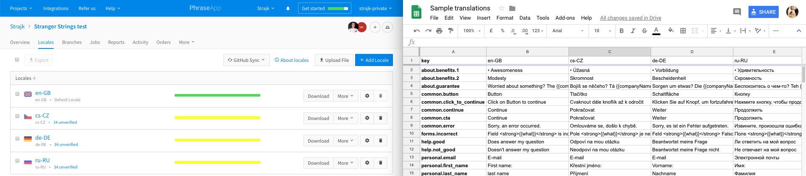

Sync PhraseApp «» Google Sheets

## Usage

`npm/yarn run ...`

* `pullGoogleSheets`
* `pullPhraseApp`
* `pushGoogleSheets`
* `pushPhraseApp`

## Requirements

* Install <https://phraseapp.com/cli>
* Install dependencies specified in `package.json` (`npm i` or `yarn`)

## Config

* Search for `FILL_IN` and replace them with proper values
    * phraseapp > `access_token` & `project_id` – can be found in PhraseApp administration
    * `GOOGLE_SHEETS_URL` – Follow https://github.com/jsoma/tabletop#1-publishing-your-google-sheet

## Demo

* Google Sheets: https://docs.google.com/spreadsheets/d/1BRjvJK2IWZhmSTeRLGcEyQDZt48MQ-ewVzhhjeKP3RY/edit

